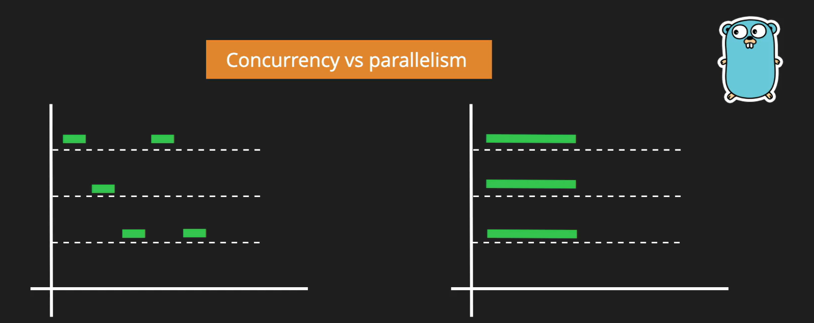
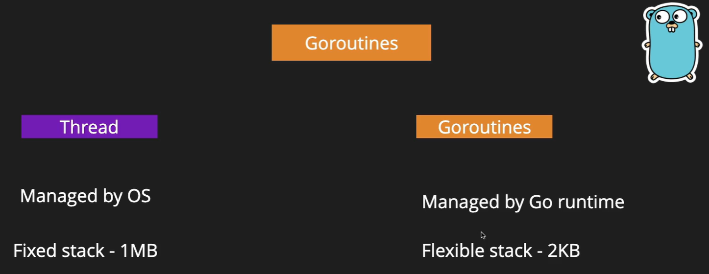

# Concurrency and Go Subroutines

- Concurrency vs Parallelism
    
- How to achieve Parallelism in Go -> Goroutines
    
- Goroutines MOTO
    ```
        "Do not communicate by sharing memory,
        instead share memory by communicating"
    ```
Initialize and Follow [main.go](./main.go)

---
[Back to Contents](../../Readme.md)
[Next Tutorial](../33tut/index.md)